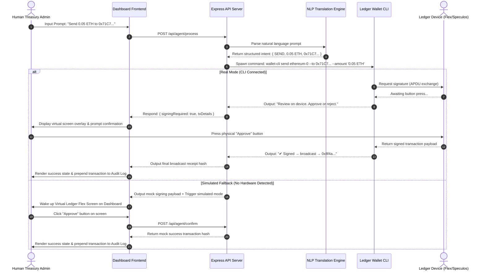

# ⚿ LedgerAgent.xyz — Hardware-Enforced AI Agent Treasury

> **"Intelligence is soft. Action is programmatic. Control must be hardware-enforced."**

**LedgerAgent.xyz** is an interactive, brutalist-styled AI Treasury Dashboard built for the **Ledger Agent Stack** developer challenge. Replicating the distinct design aesthetics of the **college.xyz** platform (cream dot-grid, thick solid borders, offset 3D shadows, and corner anchor handles), it demonstrates the integration of the **Ledger Wallet CLI** and **Device Management Kit (DMK)** to enforce hardware-grade security gates over autonomous AI agent transaction flows.

---

## 🎯 The Core Thesis: Why Software Secrets Fail

AI agents are transitioning from mere observers to active financial participants—executing swaps, balancing treasury allocations, and harvesting yield. However, the industry standard relies on **software-only secrets** (private keys stored as plaintext inside `.env` files, databases, or local runtime memories).

### The Software Security Vulnerabilities:
1. **Stealable and Replicable:** Software keys are copyable. If the server host or local memory is breached, the keys can be extracted instantly, granting total access without trace.
2. **Zero Halting Boundary:** LLM agents are susceptible to hallucination loops, smart contract exploits, and **prompt injection attacks**. Once an LLM is hijacked, a software-only agent will execute malicious transactions immediately.
3. **No Human Circuit Breaker:** In high-stakes operations, software cannot guarantee that a transaction matches user intent. It lacks a physical, air-gapped, human-in-the-loop gate.

### The LedgerAgent.xyz Solution:
By moving keys inside the **Ledger Secure Element** and utilizing the **Ledger Wallet CLI**, we decouple **Transaction Compilation** (which is done by the AI Agent) from **Transaction Signing** (which can *only* be performed on physical hardware). 

**The LLM proposes; the Human verifies.**

---

## 🏗️ System Architecture

**LedgerAgent.xyz** employs a layered gateway design that separates the natural language input, command compilation, process spawning, and on-device confirmation.

### 📐 Visual Data Flow & Security Boundaries



---

## 🔌 Core Stack Primitives

- **DMK Skills:** Structured instruction sets that teach AI coding agents how to wire USB, Bluetooth, or emulated transports to a custom application.
- **Ledger Wallet CLI (`@ledgerhq/wallet-cli`):** The terminal-driven wallet entry point executing account discovery, balances, sends, swaps, and staking with on-device validation.
- **Interactive Visual Emulator:** A client-side SVG mockup of the **Ledger Flex** device, enabling reviewers to verify the complete signing flow immediately via simulated fallbacks.

---

## 🚀 Quickstart Guide

### 1. Prerequisites
Ensure you have **Node.js** (v20+) installed.

### 2. Setup
Clone the repository and install local dependencies:
```bash
git clone https://github.com/shashank-tomar0/Ledger-AI-Treasury-Agent.git
cd Ledger-AI-Treasury-Agent
npm install
```

### 3. Run the Dashboard
Start the local dashboard server:
```bash
npm start
```
Open your browser and navigate to:
👉 **[http://localhost:8080](http://localhost:8080)**

---

## ⚙️ Running with Speculos Emulator

To run the dashboard in **Real Mode** using a local emulated Ledger Flex:

1. **Install Speculos:**
   Follow the guide on [github.com/LedgerHQ/speculos](https://github.com/LedgerHQ/speculos) to build it.
   
2. **Run a Ledger App on Speculos:**
   Launch the emulator with the Ethereum or Solana app binary:
   ```bash
   speculos --model flex apps/ethereum.elf
   ```

3. **Configure Transport Proxy:**
   Set the proxy variables in your terminal before starting the dashboard server:
   ```bash
   export LEDGER_PROXY_ADDRESS=127.0.0.1
   export LEDGER_PROXY_PORT=9999
   ```

4. **Execute Prompts:**
   Go to the dashboard, ensure the mode toggle is set to **REAL CLI**, and execute a send or swap prompt. The dashboard will communicate with the emulated device, prompting you to verify details on the Speculos screen.
